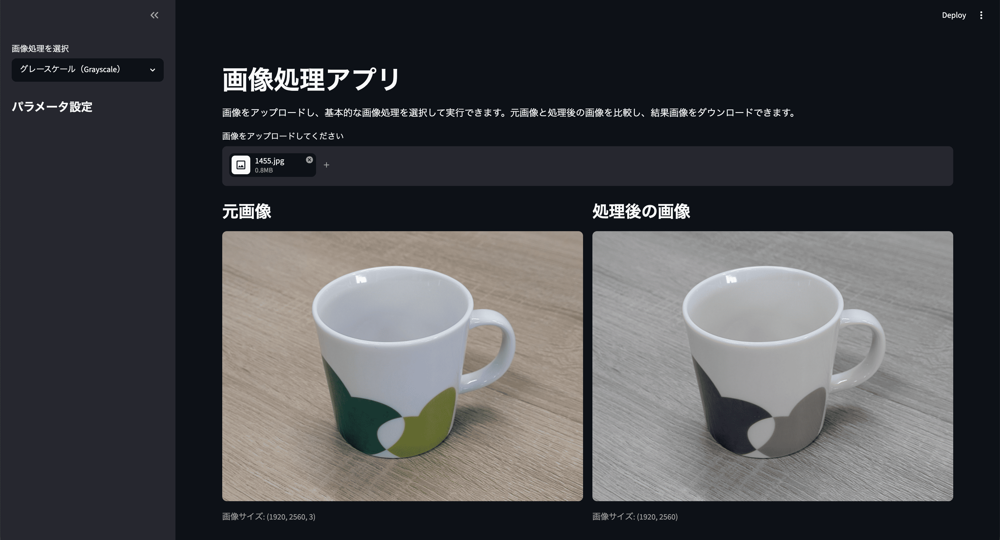

# 画像処理アプリ（image-processing-app-2）

## 概要

`image-processing-app-2` は、画像をアップロードして、基本的な画像処理をブラウザ上で試せる Streamlit アプリです。

画像を入力し、処理を選択し、パラメータを調整して、処理結果を表示・保存できます。
入力、処理、出力の流れを整理し、後から機能追加しやすい構成にすることを意識して作成しています。

## 作成目的

このプロジェクトは、GitHubに公開できる就活向けの個人プロジェクトとして作成しました。

研究で扱っている画像処理・画像解析の考え方に近いテーマを選びつつ、研究本体とは切り分けて、公開しやすいシンプルな画像処理アプリとして実装しています。

特に以下を見せることを目的にしています。

* Pythonで画像処理アプリを実装できること
* OpenCVを使った基本的な画像処理を理解していること
* Streamlitで簡単なUIを作成できること
* 入力、処理、出力を整理して設計できること
* 後から機能追加しやすいようにファイルを分けて実装できること

## 主な機能

現在のMVPでは、以下の機能を実装しています。

* 画像のアップロード
* 画像処理の選択
* パラメータの調整
* 元画像と処理後画像の比較表示
* 処理後画像のダウンロード
* 輪郭検出結果の簡単な集計表示

## 実装済みの画像処理

* リサイズ（Resize）
* グレースケール変換（Grayscale）
* ガウシアンぼかし（Gaussian Blur）
* しきい値処理（Thresholding）
* エッジ検出（Canny Edge Detection）
* 輪郭検出（Contour Detection）

## 使用技術

* Python
* OpenCV
* NumPy
* Pillow
* Streamlit
* Git / GitHub

## ディレクトリ構成

```text
image-processing-app-2/
├── README.md
├── app.py
├── requirements.txt
├── src/
│   ├── __init__.py
│   ├── processing.py
│   └── utils.py
├── samples/
│   ├── input/
│   └── output/
└── assets/
```

## 各ファイルの役割

### app.py

Streamlitアプリ本体です。

主に以下を担当します。

* 画像アップロード
* 処理メニューの表示
* パラメータ入力
* 画像処理関数の呼び出し
* 元画像と処理後画像の表示
* 処理後画像のダウンロード

### src/processing.py

画像処理の関数をまとめています。

主な関数は以下です。

* `resize_image()`
* `convert_to_grayscale()`
* `apply_gaussian_blur()`
* `apply_threshold()`
* `detect_edges()`
* `detect_contours()`

### src/utils.py

画像の読み込み、表示形式への変換、PNGエンコードなど、補助的な処理をまとめています。

## セットアップ方法

### 1. リポジトリをクローン

```bash
git clone https://github.com/ユーザー名/image-processing-app-2.git
cd image-processing-app-2
```

### 2. 仮想環境を作成

macOS / Linux の場合:

```bash
python3 -m venv .venv
source .venv/bin/activate
```

Windows の場合:

```bash
python -m venv .venv
.venv\Scripts\activate
```

### 3. 必要なライブラリをインストール

```bash
pip install -r requirements.txt
```

## 実行方法

以下のコマンドでアプリを起動します。

```bash
streamlit run app.py
```

ブラウザで以下のようなURLが開きます。

```text
http://localhost:8501
```

## 使い方

1. アプリを起動する
2. 画像をアップロードする
3. サイドバーから画像処理を選択する
4. 必要に応じてパラメータを調整する
5. 元画像と処理後画像を比較する
6. 処理後画像をダウンロードする

## スクリーンショット



## 工夫した点

* Streamlitを使い、ブラウザ上で簡単に画像処理を試せるようにしました。
* OpenCVのBGR形式と表示用のRGB形式を区別して扱うようにしました。
* `app.py` にUI、`src/processing.py` に画像処理、`src/utils.py` に補助処理を分けました。
* 画像処理ごとにパラメータを調整できるようにしました。
* 元画像と処理後画像を横並びで比較できるようにしました。
* 処理後の画像をPNGとしてダウンロードできるようにしました。

## 今後の改善点

今後は以下の機能を追加する予定です。

* 複数画像の一括処理
* 処理履歴の表示
* ヒストグラム表示
* 輪郭の面積や周囲長の詳細表示
* サンプル画像の追加
* UIデザインの改善
* PyTorchモデルを使った画像分類やセグメンテーションへの拡張

## 学習・開発メモ

このアプリでは、画像処理の基本的な流れである

```text
入力 → 処理 → 表示 → 保存
```

を整理して実装しています。

小さいアプリですが、機能をファイル単位で分けることで、後から処理を追加しやすい構成にしています。

## ライセンス

このリポジトリのライセンスは未設定です。
必要に応じて、今後MIT Licenseなどを追加予定です。
